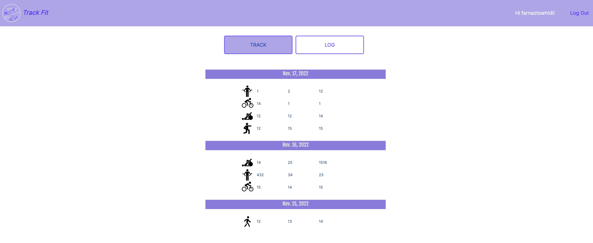

  <a href="https://github.com/DKotzer/3d-models-site">

</a>

# About Track Fit

Track Fit app is designed for those wishing to keep track of their fitness journey. Our app allows users to log various activities they have completed for the day and have them all stored in one place - track page. 
The user is able to update and delete each activity log as well in case they need to. 
The app features login so all information is stored securely to be accessed only by the logged in user.

# Team Members
1. Farnaz Towhidi
2. Anastasiia Erlikh
3. Naser Osman
4. Abdirahman Abukar
5. Ravi Chahal

# App Screenshots

_Login page_

_Sign up page_

_Home page_

_Track page_

_Log page_

_Footer_

# Technologies Used

* HTML
* CSS
* Bootstrap
* Python
* Django
* PostreSQL

# Original Wireframe

These are the original wireframes provided by the UX Design team

_Login page_

_Track page_

_Log page_

# Getting Started

Click [here](https://track-fit-app.herokuapp.com/) to deploy Track Fit App

[Trello Board](https://trello.com/b/z4hElZTv/unit-3-project)

ERD 

# Next Steps
* Add a calendar so the user can see which days they worked out and which days were skipped
* Add a weight tracker and a graph to show weight fluctuations + BMI calculator
* Add an API for recipes and calorie counter
* Allow the user to delete their account
* Admin can add an exercise to the list of exercises.
* Admin will have the ability to define a weekly plan for the client.
* Add exercise details and instructions on how to do them when clicking on exercise image.
